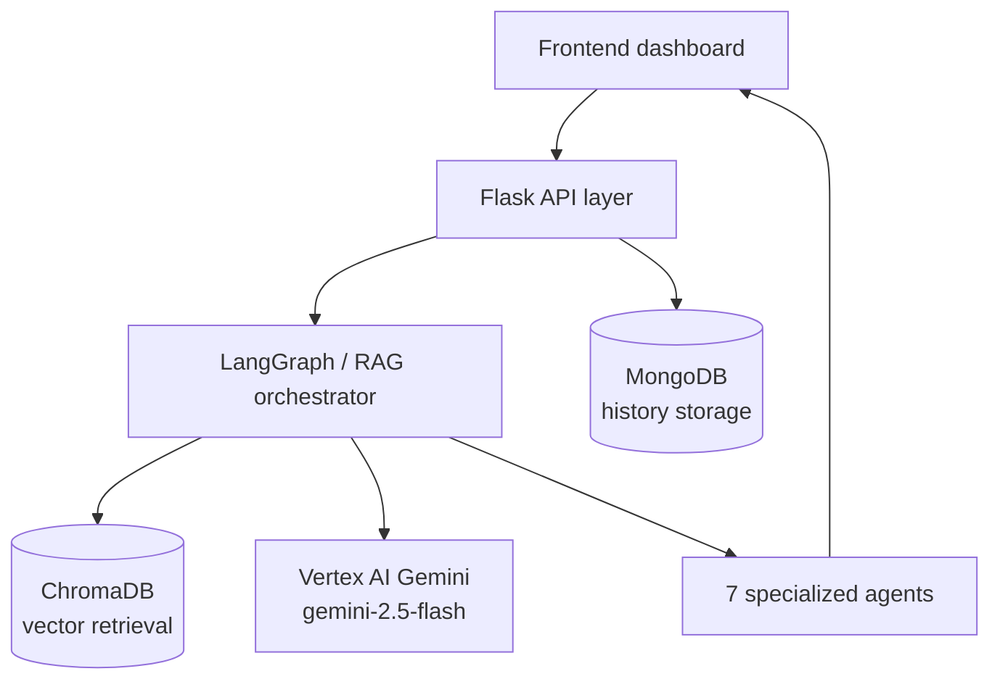
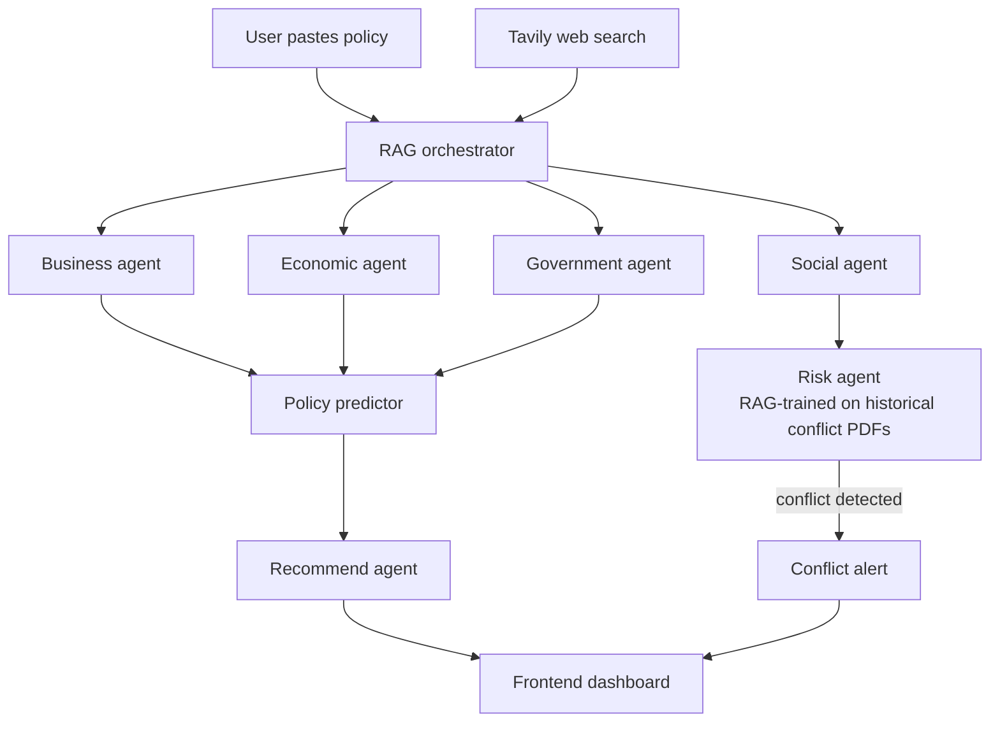

# PolicyAgentX

PolicyAgentX is an AI-powered policy simulation platform that analyzes and predicts the socio-economic, demographic, and political impact of government policies using LLMs, RAG pipelines, and multi-agent systems to enable smarter, data-driven governance.

## What This Project Does

- Simulates policy impact using a LangGraph pipeline.
- Runs advanced RAG-assisted analysis with historical and contextual retrieval.
- Orchestrates 7 specialized agents for deeper, structured insights.
- Stores analysis history in MongoDB.
- Provides a frontend dashboard for simulation, comparison, and history tracking.

## Core Features

- Multi-endpoint policy analysis API (`/simulate`, `/simulate-advanced`, `/analyze-with-agents`)
- ChromaDB-based vector retrieval for policy context
- Vertex AI Gemini integration (`gemini-2.5-flash`)
- 7-section frontend cards with confidence-scored outputs
- Policy history management (`GET /history`, `DELETE /history/<id>`)
- Policy improvement endpoint (`POST /improve`)
- Real-time web context via Tavily search, fed into the agent layer
- Conflict-risk detection: a RAG-trained risk agent flags policies likely to cause social conflict and alerts the frontend

## Graph

### System architecture



### Agent-level flow



**How it works:** a pasted policy is enriched with live web context from Tavily, then the RAG orchestrator dispatches it to four domain agents (business, economic, government, social). Their outputs feed the policy predictor, which the recommend agent turns into improvement suggestions. In parallel, the risk agent — trained via RAG on a corpus of historical conflict data (PDFs) — evaluates whether the policy could cause conflict among affected groups, and raises a real-time alert on the frontend if it does.

## Tech Stack

### Backend
- Python + Flask
- LangGraph + LangChain
- ChromaDB + SentenceTransformers
- Google Vertex AI (Gemini)
- MongoDB (PyMongo)
- Tavily (web search / retrieval augmentation)

### Frontend
- React + TypeScript + Vite
- TailwindCSS + shadcn/ui + Radix
- Recharts

## Repository Structure

```text
PolicyAgentX/
	backend/
		app/                # Flask routes, controllers, models, services
		agents/             # Domain agents + orchestrators
		graph/              # LangGraph policy graph nodes
		rag/                # RAG pipeline, retrievers, ingestion
		run.py              # Backend entrypoint
		requirements.txt
	frontend/
		src/                # React app pages, components, hooks, lib
		vite.config.ts      # Dev server + /api proxy to backend
		package.json
```

## Prerequisites

- Python 3.10+
- Node.js 18+
- npm 9+
- MongoDB running locally on `mongodb://localhost:27017/`
- Google Cloud service account JSON for Vertex AI

## Quick Start

### 1. Clone and Enter Project

```bash
git clone <your-repo-url>
cd PolicyAgentX
```

### 2. Backend Setup

```bash
cd backend
python -m venv .venv
```

Activate environment:

- Windows PowerShell:

```powershell
.\.venv\Scripts\Activate.ps1
```

- macOS/Linux:

```bash
source .venv/bin/activate
```

Install dependencies and run:

```bash
pip install -r requirements.txt
python run.py
```

Backend runs at `http://localhost:5000`.

### 3. Frontend Setup

```bash
cd ../frontend
npm install
npm run dev
```

Frontend runs at `http://localhost:8080`.

By default, frontend requests `/api/*` and Vite proxies to `http://localhost:5000`.

## Environment Configuration

### Backend variables

Set in backend shell environment or a local `.env` in `backend/`:

```env
GCP_PROJECT_ID=your-gcp-project-id
GCP_LOCATION=us-central1
DATAGOVIN_API_KEY=optional-data-gov-key
TAVILY_API_KEY=your-tavily-api-key
```

### Vertex AI credentials

Backend expects a service account file at:

`backend/service-account.json`

Notes:
- The backend sets `GOOGLE_APPLICATION_CREDENTIALS` to this file path.
- `project_id` can be auto-read from this JSON when `GCP_PROJECT_ID` is not set.
- Keep this file private and never commit real credentials.

### Frontend variables

Use `frontend/.env.example` as reference:

```env
VITE_API_URL=/api
VITE_GCP_PROJECT_ID=your-gcp-project-id
VITE_GCP_LOCATION=us-central1
```

## API Endpoints

Base URL: `http://localhost:5000`

### Health

- `GET /health`

### Simulation

- `POST /simulate` - standard LangGraph simulation
- `POST /simulate-advanced` - RAG-enhanced simulation
- `POST /analyze-with-agents` - full orchestrated multi-agent analysis

### Utilities

- `POST /upload` - upload PDF for text extraction
- `GET /history` - list policy analysis history
- `DELETE /history/<policy_id>` - delete saved record
- `POST /improve` - generate improved policy version

### Example Request

```bash
curl -X POST http://localhost:5000/analyze-with-agents \
	-H "Content-Type: application/json" \
	-d '{"text": "Increase minimum wage by 30% nationwide and phase implementation over 12 months."}'
```

## Testing

Backend integration test:

```bash
cd backend
python test_rag_agent_integration.py
```

Frontend tests:

```bash
cd frontend
npm run test
```

## License

Add your preferred license (MIT, Apache-2.0, etc.) in a `LICENSE` file.
